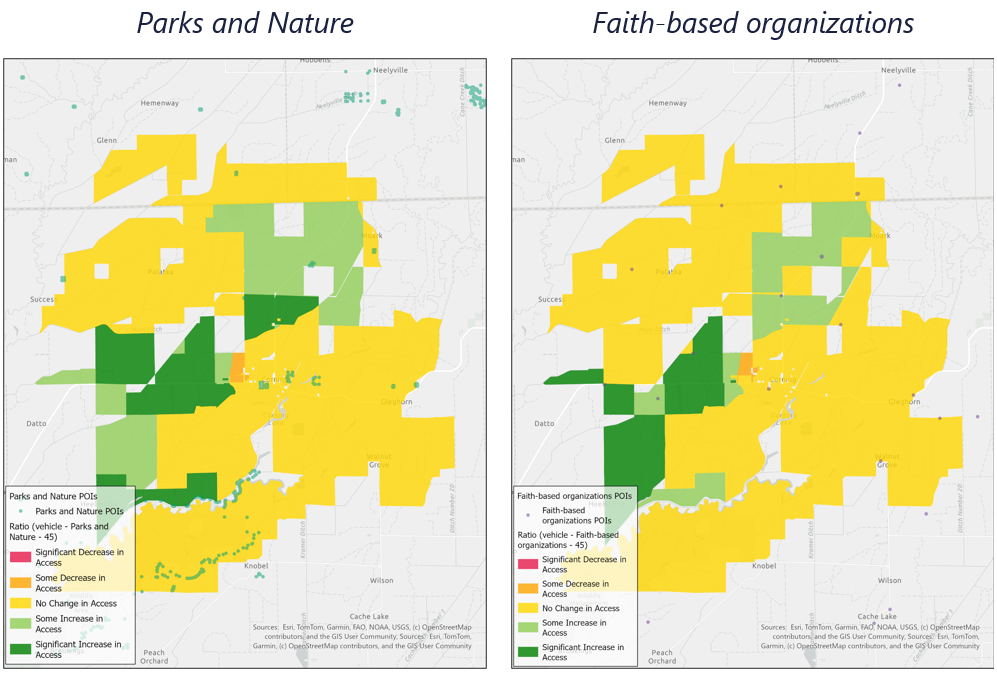
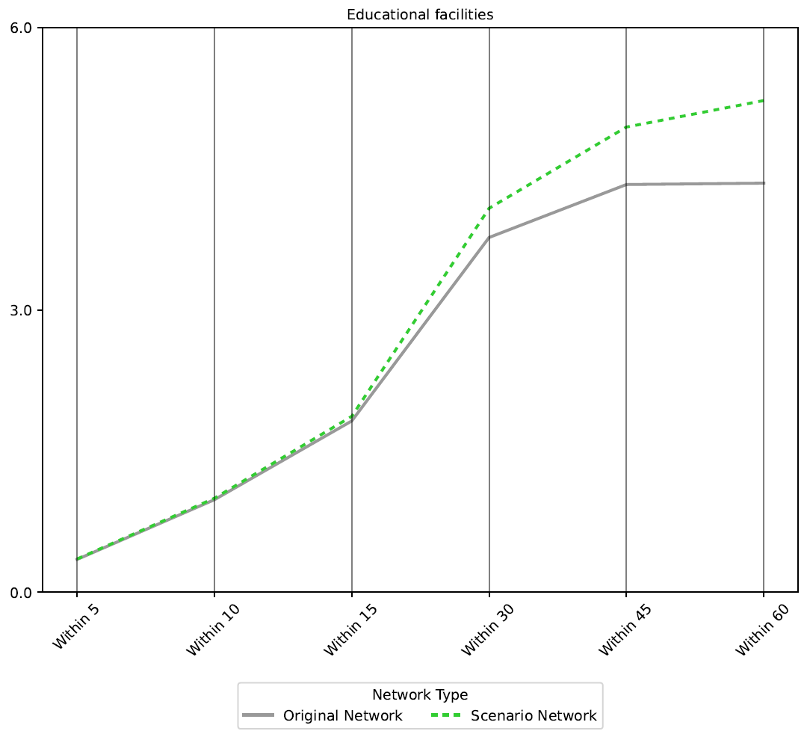
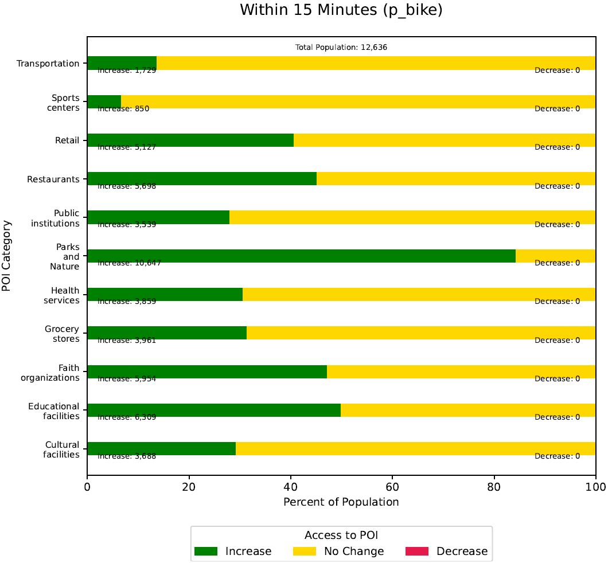
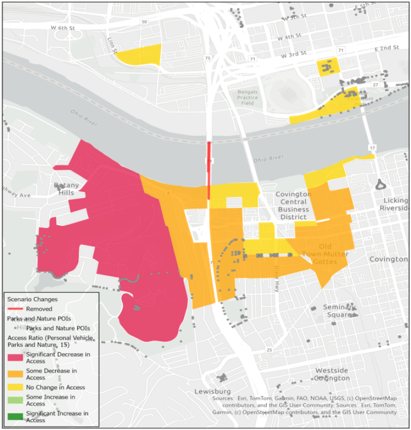
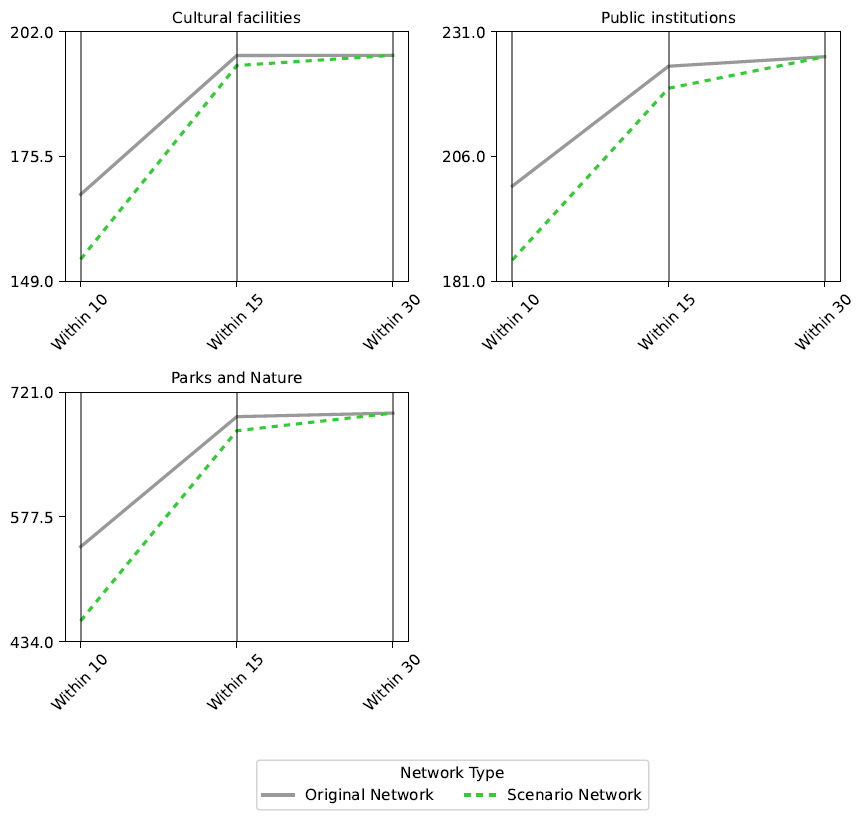
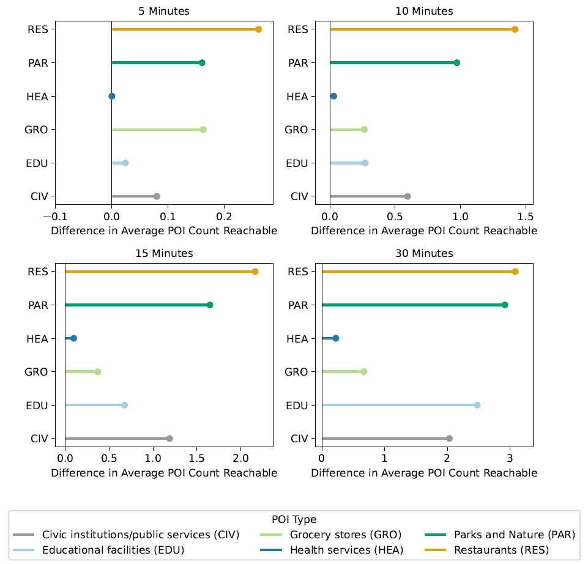
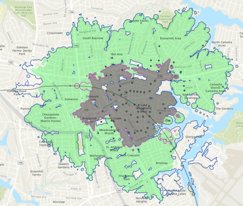
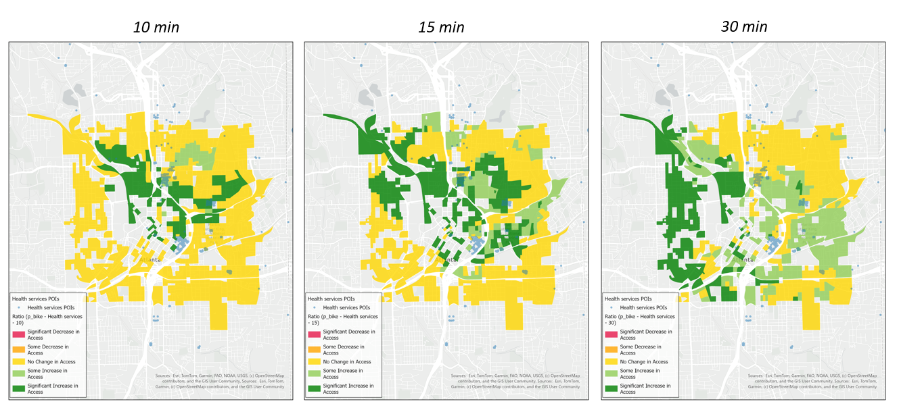

# Analysis Examples

## Corning, AR: Corning Bypass
The Corning Bypass project is a 4.1-mile rural project that will create a four-lane divided highway for the future I-57 corridor. Its purpose is to improve traffic flow by rerouting traffic around Corning and is a key step in closing a 42-mile gap in I-57. Major changes made to the network included removing connections for a footpath and a county road that are intersected by the project and adding the Corning Bypass, a two-way motorway, to the northwest of Corning.

TrACKIT results show that residents located southwest and northeast of the project could expect to experience improved access to parks, natural areas, and faith-based organizations. This outcome aligns with expectations, given the project’s southwest-northeast orientation and the quicker detour route around Corning. However, one Census block just south of the project saw a slight decrease in access due to the loss of a county road connection as a result of the project.

*Corning Bypass Project: Vehicle access changes within 45-minute travel time*

## Lincoln, IL: Low-stress pedestrian access to schools
This scenario looked at changes aimed at improving low-stress pedestrian access to educational facilities in Lincoln, IL. Interventions included new pedestrian infrastructure and pedestrian-friendly upgrades to existing travel network links, with most changes concentrated along four corridors on the western edge of downtown Lincoln. 

TrACKIT results show that an average resident could expect to see an improvement in the number of educational facilities accessible via low-stress pedestrian routes in a 30-60 minute travel time window.

*Lincoln, IL: Increase in the number of educational facilities accessible to an average resident via low-stress pedestrian routes at various travel time thresholds*

## Missoula, MT: Bridging access to new destinations
This scenario examined the effect of adding a new bike/pedestrian facility across an existing railroad bridge just west of downtown Missoula, MT. The retrofitted bridge would connect two existing trail networks in Missoula: the Milwaukee Trail and the Bitterroot Trail.

TrACKIT results show that a large proportion of residents in the study area could expect increased access to destinations within 15-minutes on low-stress bike routes across all point of interest categories examined.

*Missoula, MT: Number of residents who can expect an increase in 15-minute low-stress bike access across a range of point of interest categories*

## Cincinnati, OH & Covington, KY: Bridge closure impacts to access
This scenario examines the potential access impacts to residents of downtown Cincinnati and Covington in the event of a bridge closure to the Brent Spencer Bridge. The study area focuses on populated Census Blocks proximate to the bridge; Census Blocks with no residents are automatically excluded from the analysis.

TrACKIT results show that residents to the west of downtown Covington in particular could expect a significant decrease in the number of cultural facilities, public institutions, and parks and nature accessible within a 10- and 15-minute travel time by vehicle. This decrease in access, however, is no longer noticeable within the 30-minute travel time window. This suggests that residents may require longer travel times to reach the same number of destinations in the event of a bridge closure, but that the closure would likely not fundamentally prevent their access to these amenities if longer travel times are accounted for.

*Cincinnati, OH and Covington, KY: Change in access to parks and nature within 15-minute travel times by vehicle*

*Cincinnati, OH and Covington, KY: The average resident sees a decrease in access within the 10- and 15-minute travel time windows, but no impact to 30-minute travel time window*

## Frankfort, KY: Holmes Street Corridor with manual edits to supplement OSM data
The Holmes Street Corridor project proposes to reconfigure Holmes Street in Frankfort, KY to improve accessibility for pedestrians and cyclists. The existing roadway, which has no bike lanes and limited sidewalks, would be reconfigured with safe pedestrian crossings and bike facilities.

The existing data available from OpenStreetMap for Frankfort, KY, are limited. Therefore, manual edits were made to the base dataset to supplement the OSM data and correctly account for existing roadway infrastructure and the current locations of low stress links for pedestrians and cyclists. Additional POIs were also added to supplement the existing OSM data, including several churches and dollar stores. After enhancing the baseline travel network data, manual edits to the scenario network modeled the planned upgrades to Holmes Street to add low-stress pedestrian and bike infrastructure.

TrACKIT results indicate benefits for pedestrian and bicycle access on low stress networks to amenities like restaurants, educational facilities, and parks. The improvement in access is particularly noticeable for both 15- and 30-minute travel times on the low-stress bicycle network. Restaurants and parks show the greatest improvement in access overall, with educational facilities and civic institutions also becoming more accessible to an average resident.

*Frankfort, KY: Change in the number of POIs accessible to the average resident within 5, 10, 15, and 30 minutes of travel on the low-stress bicycle network*

## Norfolk, VA: Exploring travel sheds
This test scenario explores a potential infrastructure addition in the northeast corner of Norfolk, VA. The visualization below provides a good example of TrACKIT's sensitivity to on-the-ground detail and variations in the travel network and surrounding topology, even for relatively small travel time thresholds.

TrACKIT results demonstrate expansion of the 10- and 15-minute travel shed areas accessible by bike. As expected, access improvements are concentrated to the west and southeast, following the potential alignment of the infrastructure addition shown in this test scenario. Note that travel shed expansion is naturally constrained by the inlets and water bodies on the eastern side of the map. 

Also note that travel sheds can appear "blobby". This is because TrACKIT generates travel sheds by identifying travel network nodes that are reachable within the selected travel time and then buffering them with the off-network walking distance that can be reached at walking speed to fully "use up" the specified travel time.

*Norfolk, VA: Change to 10-minute travel shed (original = gray fill, expanded = pink line) and 15-minute travel shed (original = green fill, expanded = blue line) accessible by bike*

## Atlanta, GA: Urban travel network changes
This scenario models changes to the street network to reflect a potential highway cap park, the addition of protected bike infrastructure, a two-way street conversion, and street reconnections. OSM data for this project area was well defined for vehicle, pedestrian, and bicycle traffic.

TrACKIT results show significant gains in low-stress bicycle access to health services. These results reflect the project’s addition of protected bike lanes. These improvements, driven by the project’s addition of protected bike lanes, are evident at the 10-, 15-, and 30-minute travel time thresholds. These benefits increase progressively as the travel time threshold expands.

*Atlanta, GA: Low-stress bicycle access to health services*

