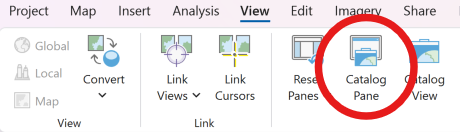
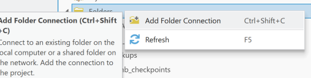
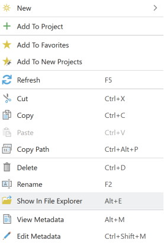
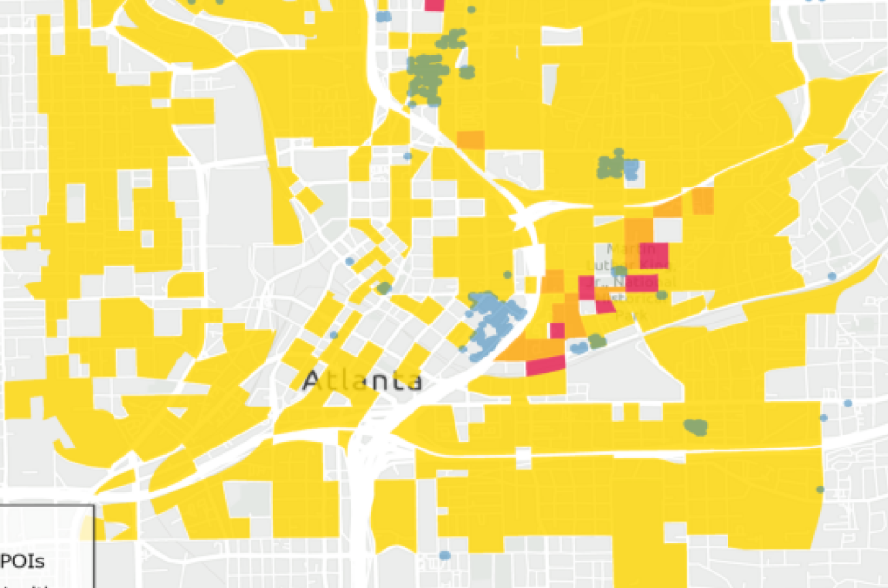
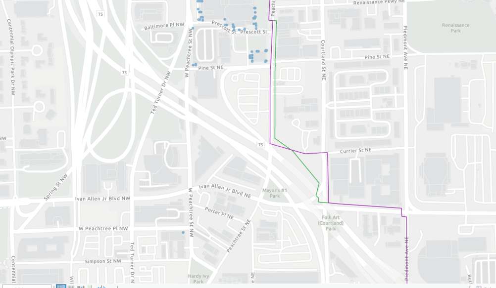

# FAQs and Troubleshooting

## 1. How do I find files created by TrACKIT?
All files created by TrACKIT will be in the folder selected by the user in [Step 1A](step1/#step-1a-download-base-osm-data). The tool will create subfolders for scenarios and other steps. Adding a folder connection[^1] will help check the progress of the tool.

1. Add a catalog pane to the ArcGIS Project:
   
2. Right-click on Folders and click Add Folder Connection:
   
3. Select the folder used in [Step 1A](step1/#step-1a-download-base-osm-data) and click OK.

Some files will not be visible in the ArcGIS Pro Catalog pane (such as OSM XML files). Right-click on the connected folder and choose "Show in File Explorer" or "Copy Path" and paste the path in a Windows Explorer window:

## 2. How much disk space do I need and what are expected run times?
TrACKIT’s run times and disk space requirements are directly tied to the size of your project area. Because larger projects require more storage for OSM data and scenario subsets, the TrACKIT team recommends having at least 20 GB of available disk space. While the tool may not use this entire amount, this buffer ensures you have enough room to accommodate the temporary files that ArcGIS Pro generates during processing.

Project size also dictates how long each step takes to process. Depending on your hardware specifications and internet speed, running every tool for a very large project can take several hours from start to finish. While most individual tools only take a couple of minutes to execute, the heavier processing steps can take up to 45 minutes each. If you need to optimize performance and reduce these hardware demands, you can decrease the overall size of a scenario by selecting fewer modes, setting a shorter radius distance, or choosing fewer POI categories.

## 3. Why am I getting download errors, empty files, or files saved in unexpected locations?
First, double-check that the entered latitude and longitude are correct. Latitude is the y-coordinate, longitude is the x-coordinate. If your project is in North America, latitude should be positive, and longitude should be negative. If you have a map open, right-click on the project center and choose Copy Coordinates. This will give you the Decimal Degrees that the tool should be able to read.

TrACKIT relies on the Overpass API to download local copies of OSM data in the project area. This is a free, limited resource that may not always have the necessary server capacity available. Occasionally, especially for large project areas, TrACKIT may fail to complete the OSM download. This will create a warning and/or error in the [Step 1A](step1/#step-1a-download-base-osm-data) tool Details window. If this happens, wait a few minutes before trying again.

## 4. How do I handle missing network data or misclassified OpenStreetMap classifications?
OSM generally is up-to-date and detailed. Sometimes, in areas with fewer OSM users providing updates, there may be gaps or errors in the network. If there are errors in the network after running [Step 1B](step1/#step-1b-prepare-network-data-from-osm), you can directly edit the “project_network_ways” layer at this stage, filling out all the fields. You can also provide feedback or make edits directly to OpenStreetMap on these missing locations.

## 5. How do I handle missing POIs?
OSM-derived POIs may be missing relevant locations for a project or may be out of date with closed or newly-opened POIs. If this is the case, after running [Step 1C](step1/#step-1c-prepare-poi-data-from-osm), use [Step 1D](step1/#step-1d-import-custom-poi-data-optional) to supplement the automatically created POIs. You can create POIs that match TrACKIT’s default categories, or add new POI categories in [Step 1C](step1/#step-1c-prepare-poi-data-from-osm). You may also manually delete or move POIs that are not correct. Do not change the default POI categories/classes, since this can create errors. You can also provide feedback or make edits directly to OSM on these missing locations.

## 6. How are POIs linked to the network to support the access analysis?
The toolbox starts from each network node and searches for all POIs within a buffer distance defined in the "Maximum Search Distance from Network Node to POI (Feet)" parameter in [Step 2E](step2/#step-2e-match-pois-to-network-nodes). If a given POI is located within this search distance from a given network node, it becomes associated with that node for routing purposes.

This is based on the assumption that a resident may need to travel some off-network distance (up to the "Maximum Search Distance from Network Node to POI (Feet)" value) to reach a given POI. The toolbox also assumes that this off-network distance will be traversed at walking speed and computes the travel time required to walk in a straight line from the associated network node to the POI. The travel time from an origin to any given POI is then calculated as:

  <i>Travel time to POI</i> &nbsp;=&nbsp; <i>On network travel time</i> &nbsp;+&nbsp; <i>Off network travel time (walking speed)</i>

In some cases, a specific POI may be accessible from an origin via multiple network nodes (e.g., a park with a large perimeter will have many different ingress opportunities). When this happens, the toolbox selects the shortest travel time to this POI for use in metric computations.

There are some cases where a POI that you expect to be reachable may not attach to the network. This could occur because:

* The toolbox does *not* allow POIs to attach at any arbitrary point along a network **link**. Instead, POIs must fall within the maximum search distance from a network **node**. This assumption is required to limit the routing complexity to a computationally manageable scale. If POIs do not seem to be attaching to the network as expected, you may need to adjust the "Maximum Segment Length (Feet)" parameter in [Step 2C](step2/#step-2c-integrate-manual-edits-into-scenario-network) to split network links and generate network nodes at more regular intervals, thereby increasing the density of network nodes and allowing more egress opportunities from the network to POIs.
* POIs that can only connect to network nodes on motorways (i.e., limited access freeways) or motorway links (i.e., ramps to limited access freeways) are not attached to the network, since destinations are almost never accessible directly from limited access freeways.

Note that the toolbox does *not* force a one-to-one connection between network nodes and POIs. Instead, this approach allows many POIs to link to the same network node for routing purposes. Conversely, it also allows individual POIs to link to multiple different network nodes, if the POI is accessible via multiple points of ingress. It also allows POIs that fall outside of the selected search radius to remain unlinked and inaccessible on the network. This closely approximates the on-the-ground complexity of how POIs can relate to a travel network, while also allowing routing to occur at a computationally manageable scale.

## 7. How can I account for expected changes in travel speed resulting from a project?
You can adjust modal speeds for specific links in [Step 2B](step2/#step-2b-make-manual-edits-to-the-scenario-network). This allows you to model how changes in travel speed might impact overall access metrics.

## 8. What should I do if I get unexpected results?
During Step 3, you may occasionally encounter access metrics that produce unexpected results. As an example, suppose a cluster of red‑colored Census Blocks appear south of a project area where a decrease in access to Health Services was not anticipated.

To investigate, use the Travel Sheds tool on one of the affected Census Blocks. If it reveals that access is dropping to a cluster located nearby, leverage the routing tool ([Step 3G: Trace Shortest Path Between Two Network Nodes](step3.md#step-3g-trace-shortest-path-between-two-network-nodes)) to generate paths for both pre- and post-network profiles.

Often, you'll discover recent network edits accidentally broke or removed a minor vertex link path that was previously available, extending travel times. Correcting that layout in [Step 2B](step2/#step-2b-make-manual-edits-to-the-scenario-network) fixes the metrics downstream.

## 9. How do I share my project with someone else?
Use the Maintenance ➔ Manage Projects ➔ Operation: "Export Project as Zip Archive" tool. This will create a zip file of your project (including all scenarios). The zip file will be in the same folder/directory as the project. Share this zip file, and the person you share with can use the Maintenance ➔ Manage Projects ➔ Operation: "Import Zip Archive as Project" tool. These tools will work together. If you create your own zip file, the import tool may fail; instead, extract the zip file then use the Maintenance ➔ Manage Projects ➔ Operation: "Import Folder as Project" tool.

## 10. I lost my projects in the drop-down list. How do I get them back?
Use the Maintenance ➔ Manage Projects ➔ Operation: "Import Folder as Project" tool and select the project folder (e.g., name + "_project"). You will need to do this for each project. If there is an error when running this tool, confirm the folder contains a gdb folder with the project name + "_data".

[^1]: https://doc.esri.com/en/arcgis-pro/latest/help/projects/connect-to-a-folder.html
