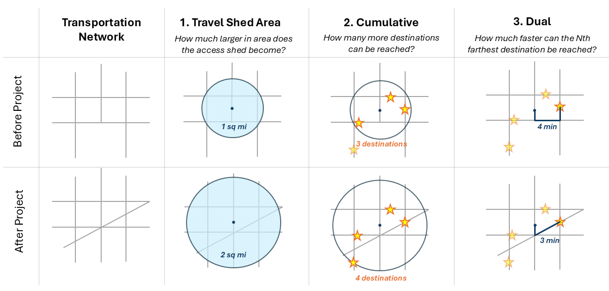

#Transportation Access and Connectivity Key Insights Tool (TrACKIT): User Guide

> **TrACKIT helps transportation analysts examine how infrastructure changes can affect people’s ability to reach key destinations.**

## Introduction

The Transportation Access and Connectivity Key Insights Tool (TrACKIT) is a scenario testing toolbox built in Python for ArcGIS Pro that quantifies how transportation infrastructure changes can affect people’s ability to reach key destinations. TrACKIT computes shortest path travel times between origins and a range of different points of interest (POI) to provide travel time comparisons before and after an infrastructure change.[^1] The toolbox delivers an approachable yet rigorous way to quantitatively assess and compare access impacts.

The toolbox uses publicly available OpenStreetMap (OSM) data as the starting point for the analysis, making it easy for users to get started without any need for external data collection or preparation. Users also have the option to enrich their analysis scenarios with custom origins or points of interest, if needed.

TrACKIT's step-by-step interface is designed to be approachable for users with a baseline familiarity with spatial analysis tools. No specialized GIS or coding background is required.

## What can I analyze using TrACKIT?

TrACKIT currently supports a wide array of customizable analysis parameters:

- **6 travel modes:** Vehicle, freight truck,[^2] pedestrian, bicycle, low stress pedestrian, and low stress bicycle
- **14 default POI types:** Includes cultural facilities, parks, grocery stores, K-12 schools, restaurants, and hospitals. Users also have the option to incorporate custom POIs.
- **3 origin types:** Analyses can be run on Census blocks, custom points, or custom polygons as origins
- **Demographic weighting for metrics:** Access metrics can be weighted using Census population, Census household units, or custom weights

TrACKIT measures changes in access using three distinct metric types:

- **Travel shed areas (isochrones):** Measures the area accessible from a given origin within a specified travel time threshold.
- **Cumulative metrics:** Measures the total number of destinations reachable within a travel time threshold.
- **Dual metrics:** Measures the time required to reach the Nth closest destination.

By combining the parameters and metric types above, users can use TrACKIT to evaluate access impacts for a variety of projects, such as:

- **New pedestrian/bicycle infrastructure:** How does a new multi-use path or pedestrian bridge change the number of restaurants or grocery stores available to nearby residents via low-stress bicycle modes?
- **New roadway connections:** How does a new highway on/off ramp change the travel shed areas originating from freight generating facilities? Or, how does a new road connection change the travel time from local schools to the closest hospital?
- **Infrastructure disruption/closure:** How many fewer retail sites, parks, and public services are available to households within a specified travel time following the closure of a local bridge?
- **Population impacts:** How many residents in the study area can expect to be affected by improved, worsened, or no change in access?

!!! info "TrACKIT tip"
    Because of the computational complexity involved in travel time analysis, TrACKIT works best for travel networks with a radius of ~30 miles or less. That's a sufficient radius to analyze travel time thresholds of ~30 minutes or less for vehicles traveling at highway speeds. (Note: A manageable radius can vary based on the user's computer specifications, and may be slightly smaller for dense urban networks and slightly larger for sparse rural networks.)

## Credits

TrACKIT was developed at the U.S. Department of Transportation’s Volpe National Transportation Systems Center in support of the Federal Highway Administration (FHWA).

The toolbox uses [OpenStreetMap (OSM)](openstreetmap.org/copyright) data, available under the Open Database License. TrACKIT relies on the Overpass API to download local copies of OSM data for analysis.

Portions of the code in this project were developed with the assistance of Google Gemini and ChatGPT. AI coding assistants were used for brainstorming structural logic and providing debugging assistance, with all resulting code reviewed and refined by the authors. Final responsibility for the content and functionality of this toolbox rests entirely with the human authors. 

 

[^1]: Note that TrACKIT uses a congestion-agnostic approach to calculate travel times. It does not model traffic congestion directly or function as a travel demand model. Instead, it assumes all travel network links are operating at their default speed. (See [Network Attribute Assignment Rules](network_assignment_rules.md) for more details on how default speeds are assigned.) TrACKIT is focused on quantifying the impacts of changes to travel network geometry and connectivity rather than operational traffic flows.

[^2]: Beta version
