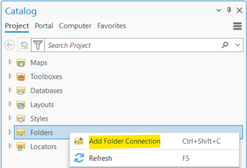
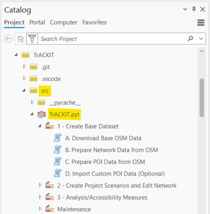

# Installation

TrACKIT is designed to run in ArcGIS Pro on a standard laptop. Suggested minimum specifications:

- Esri ArcGIS Pro; version 3.4 or higher, with Basic license
- 16GB RAM
- Dedicated graphics card (recommended)

Install TrACKIT using the steps below:

1. **Make sure you have the required programs.**
   To use TrACKIT, you will need Esri ArcGIS Pro version 3.4 or newer. An ArcGIS Pro Basic license is sufficient to run the toolbox; you do not need Advanced licensing or extensions. For best results, your computer should have a reasonable amount of disk storage space remaining (~25 GB) and should have _at least_ 16 GB of RAM.

2. **Download the TrACKIT tool.**
   Download the TrACKIT tool using this [download link](https://github.com/VolpeUSDOT/TrACKIT-Public/releases/latest/download/TrACKIT.zip). Once the file is downloaded to your computer, unzip the folder. All files in the repository are required for TrACKIT to run properly. Do not move files around within the folder or the tool will not run properly. (Optional: The TrACKIT tool is hosted in the [TrACKIT GitHub repository](https://github.com/VolpeUSDOT/TrACKIT-Public), so if you prefer, you can clone the repository directly from GitHub instead of downloading it as a .zip file.) *By downloading the tool, you agree to the terms of the [TrACKIT License Agreement](EULA.md).*

3. **Open ArcGIS Pro and create a new ArcGIS Pro Project.**
   Create a new Project in ArcGIS Pro to house your TrACKIT analysis. When creating your Project in ArcGIS Pro, make sure you have a blank map open.

4. **Open the TrACKIT toolbox in ArcGIS Pro.**
   In the Catalog pane, right click “Folders”, then select “Add Folder Connection”:

   

   Navigate to where the TrACKIT source code is stored on your computer. In the open File Explorer window within ArcGIS Pro, you may need to “refresh” the files to ensure you are connecting to the most recent version of your files. Select the TrACKIT source code folder to add it as a folder in your project. Within this folder in the ArcGIS Catalog pane, expand the “src” subfolder to expose the “TrACKIT.pyt” toolbox file. Click the arrow next to the “TrACKIT.pyt” file to expand the TrACKIT toolbox and reveal the constituent tools. Double-click on a tool to launch it:

   

!!! info "TrACKIT tip"
    When running the TrACKIT tools, you should **run each step in the exact order it is shown in the toolbox**. Step 1A needs to be run before Step 1B, which needs to be run before Step 1C, etc. If you ever need to go back and re-run a step, that’s fine—the toolbox will erase your prior work for that step and re-compute as needed. But be careful, because **anytime you re-run a step, you _also_ need to go back and re-run all subsequent steps, in order**.

You are now ready to run TrACKIT!

[Continue to Step 1](step1.md){: .md-button style="font-size: 1.5em; padding: 0.8rem 2rem; display: block; width: max-content; margin: 2rem auto; background-color: #eeeeee; border: 2px solid black; color: black;" }