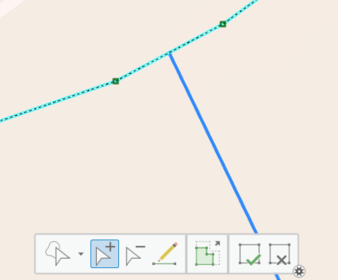
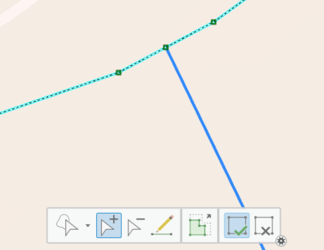

# Network Edit Instructions

This page describes how to make manual edits to the scenario network after running [Step 2B](step2/#step-2b-make-manual-edits-to-the-scenario-network) and before running [Step 2C](step2/#step-2c-integrate-manual-edits-into-scenario-network). Following the order of these instructions is recommended to improve the efficiency of the editing process. **Note that only the scenario network *links* dataset needs to be manually adjusted.** The scenario network *nodes* dataset does not need to be manually adjusted, as these will be updated in the next step in the toolbox, which will automatically integrate your changes into the network and generate a final network dataset that is ready for analysis.

## Part 1: Prepare Network Layer for Editing
First, get your “Scenario Network Ways” layer ready for editing. The TrACKIT Team recommends that, if you are collaborating with team members on network edits, you make a copy of the “scenario_network_ways” layer located in your scenario’s geodatabase and publish it to ArcGIS Online (AGO). This will create a feature service layer that can be shared in an AGO Group with other contributors. This allows editing responsibilities to be shared and synced on AGO.

If you are managing edits on your own, you may simply edit your local copy of “Scenario Network Ways” in the map that was generated in [Step 2B](step2/#step-2b-make-manual-edits-to-the-scenario-network). (Also note: If you make editing mistakes and find yourself needing to start over at some point, it is always possible to re-run Steps [2A](step2/#step-2a-create-project-scenario-dataset) and [2B](step2/#step-2b-make-manual-edits-to-the-scenario-network) to re-generate a fresh version of the scenario dataset at any time.)

Once the “Scenario Network Ways” layer is displayed on the map, open the Edit tab in ArcGIS Pro. Turn on “Snapping” with standard vertex and edge parameters active.

## Part 2: Make Changes to Scenario’s Original Network, If Existing Data is Incomplete or Inaccurate
While the OSM data used to generate the original network is generally quite comprehensive, you may still discover some inaccuracies in the OSM data when examining the data close to your scenario. If there are network omissions or inaccuracies that are substantial enough that they may affect travel time calculations, you will want to correct or add any links that are missing from the OSM-generated network. You can change the geometry of existing links or manually draw in new links, as needed. These new links should be marked as “Exists in Original Network” = 1/Yes and “Exists in Scenario Network” = 1/Yes if they exist before and after the project. When drawing these links, make sure to follow the rules outlined in [Part 4](network_edits/#part-4-sketch-out-new-links-for-additional-infrastructure) below.

You may also discover that the OSM-generated network contains superfluous links that do not reflect the on-the-ground realities near your project location. If this happens, you can permanently remove a link from the network by deleting the feature entirely or by assigning “Exists in Original Network” = 0/No and “Exists in Scenario Network” = 0/No. Both of these approaches will result in the link being entirely removed from your access impact analysis.

## Part 3: Mark Links that are <strong style="color: #FF0000;">Removed</strong> in the Scenario
If the scenario will result in the removal of any links from the network, change “Exists in Scenario Network” to 0/No for those links, while keeping “Exists in Original Network” set to 1/Yes. **You should also flag any features that are removed as part of the scenario with a value of “REMOVED” in the “Scenario Action” field.** Do not, however, delete these links from the network, as this would exclude them from the pre-/post- comparison entirely.

For any links that will not be removed or have attributes adjusted, check that “Exists in Scenario Network” is equal to 1/Yes. This is the default value assigned to all links when the scenario is generated, based on the assumption that most of the network configuration will remain unchanged in a given scenario. No additional work is required on your part to address unchanged links.

## Part 4: Sketch Out <strong style="color: #0070FF;">New</strong> Links for Additional Infrastructure
If the project will result in new links to the network, draw these using the “Create Features” function under the “Edit” ribbon. Ensure “Snapping” is on. Use “Scenario Network Ways” as the template. These new links should be marked as “Exists in Original Network” = 0/No and “Exists in Scenario Network” = 1/Yes. **It is crucial to flag any newly drawn features with a value of “NEW” in the “Scenario Action” field**, as this value is used in [Step 2C](step2/#step-2c-integrate-manual-edits-into-scenario-network).

When drawing a new link, you should **use the basic “Line” option in the “Create Features” tool** to draw new features. (Note: *Never* use the “Split” option when drawing new network links, as this can cause attributes to be deleted from existing network links when new links are drawn on top of them. *Always* use the basic “Line” option for creating new links in your scenario.) The approach to drawing the link depends on how the new link should connect with the rest of the travel network:

- **Option 1: Link *with* connection to intersecting network links:** Generally, you will want your newly drawn lines to connect to other lines in your network. When this is the case, any newly drawn link and its connecting links *must* share a vertex. This shared vertex is the condition used by the tool to create new connections that allow travel flow between links. As you draw the new link, click your mouse to create new vertices along the link where it meets any intersecting line where connection is desired. These vertices should snap to the intersecting lines, since you turned “Snapping” on in [Part 1](network_edits/#part-1-prepare-network-layer-for-editing). When you are done drawing, click the green checkbox to “Finish.”

    Because the shared vertices condition requires **both** the newly drawn link **and** any connecting link to have a vertex at the exact same location, it is imperative to **check that there is a shared vertex on all links that intersect your new link, if a connection between them is desired**. To check where vertices exist, use the “Edit Vertices” tool that can be opened from the “Edit” ribbon.

    Then, select and inspect each of the links that the new line intersects and then ensure that these links have their own vertices at the intersection with the new line. For example, the images below show how you would add a vertex to an existing road (highlighted in light blue with existing vertices visible) to make sure it connects with a new link (coming from the southeast corner, highlighted in dark blue). 

    

    

        <strong style="display: block; margin-bottom: 7px; font-size: 85%;">Before adding shared vertex</strong>
        
    

    
    

        <strong style="display: block; margin-bottom: 7px; font-size: 85%;">After adding shared vertex</strong>
        
    

    

    If a new link needs to intersect with two fully overlapping links in the existing travel network—which is often the case when a reversed link has been added on top of a one-way link in the existing travel network—each separate link in the existing network must have a shared vertex added to it separately to ensure both links connect with the new link. To check and edit each link separately, you will need to select a single link at a time in the “Edit Vertices” selection pane, then proceed to add required vertices for each separate link.

    !!! info "**Key point**"
        Wherever two or more connected network links cross, **each** of the links should have a vertex at the exact same location. Otherwise, there will be **no** connection between them in the network.

- **Option 2: Link *without* connection to intersecting network links:** In some instances, you may want your newly drawn line to travel over or under an existing feature, meaning you do *not* want connectivity between your new link and other network links. This may be the case when two links in the network are at a separated grade, such as a road crossing over a trail or a freeway interchange. In this case, simply draw links with vertices that *do not* overlap with any other link’s vertices.

## Part 5: Copy Existing Link Geometries and <strong style="color: #A900E6;">Update</strong> Attributes
If a link’s attributes change as a result of your scenario (e.g., a new bike lane or sidewalk is added along an existing link) but the geometry of the link has not changed, make a copy of the existing link feature and then adjust the attributes on the new copy, while preserving the original link. You can do this using the copy/paste functions in ArcGIS (preferred), which can be found in the “Map” ribbon under the “Clipboard” group. Or you can manually trace over the existing feature, ensuring that the vertices of your new traced link connect to endpoints or vertices of other network links where connectivity is desired.

Mark each version of the link—both the original and the copy—with the appropriate “Exists in Original Network” and “Exists in Scenario Network” values. The original link should be labeled with “Exists in Original Network” = 1/Yes and “Exists in Scenario Network” = 0/No. The new copy of the link should be labeled with “Exists in Original Network” = 0/No and Exists in Scenario Network” = 1/Yes. See [Part 6](network_edits/#part-6-assign-link-attribute-values) below for instructions on adjusting attributes of the new link.

**It is also important to flag any copied version of a link, representing a new infrastructure configuration being explored in the scenario, with a value of “UPDATED” in the “Scenario Action” field**, as these values are used in [Step 2C](step2/#step-2c-integrate-manual-edits-into-scenario-network). The original link, representing the original network configuration, should have a Null value in the “Scenario Action” field. Your copied links will contain the Feature ID inherited from the original version of the link; this is fine to keep for now, as the “Updated” flag will force the tool to generate new Feature IDs for these links in subsequent steps.

!!! info "**Efficiency tip**" 
    Instead of working link by link, you may find it faster to work on multiple links at the same time. To do this, you can select several links in the existing network and copy them together as a group. You can then edit the attributes on your new copied links all at the same time by launching the “Attributes” panel.

    From there, highlight all of your selected links at the top of the panel and adjust the values of their attribute fields at the bottom of the panel. Then, click “Apply” to apply the updates to all of the selected links. When you are finished copying and updating links, always remember to save your edits by clicking “Save” in the “Edit” tab.

When you are finished copying and updating links, always remember to save your edits by clicking “Save” in the “Edit” tab.

## Part 6: Assign Link Attribute Values
For newly drawn or copied links, assign new attribute values for the fields in the table below. Note that **ID fields (Feature ID, From ID, To ID) do not need to be edited**; the next step in the toolbox will assign or reassign new values to these fields for affected links. If you prefer to use the default speeds and modes for each highway type, you may leave the speed and modal flag fields blank; the tool will intelligently auto-populate them using the “Original Tag Label” (highway) field as a reference. More details are available in [Network Attribute Assignment Rules](network_assignment_rules/#2-manual-edit-integration-defaults-auto-population).

| Field Alias | Field Name | Values |
| :--- | :--- | :--- |
| Original Tag Label | highway | See [Network Attribute Assignment Rules](network_assignment_rules/osm-attribute-assignment-rules) |
| Way is a Motorway | is_motorway | 0 if not a motorway, 1 if it is |
| Segment is Oneway | oneway | “no” or “yes” |
| Personal Vehicle Mode | vehicle | 0 if blocked, 1 if permitted |
| Freight Truck Mode | Truck | 0 if blocked, 1 if permitted |
| Pedestrian Mode | pedestrian | 0 if blocked, 1 if permitted |
| Bicycle Mode | bike | 0 if blocked, 1 if permitted |
| Low-Stress Walking Mode | p_pedestrian | 0 if high stress, 1 if low stress |
| Low-Stress Bicycle Mode | p_bike | 0 if high stress, 1 if low stress |
| Speed for Vehicle | speed_vehicle | See [Network Attribute Assignment Rules](network_assignment_rules/osm-attribute-assignment-rules) |
| Speed for Walking | speed_pedestrian | 3 mph |
| Speed for Bicycle | speed_bike | 10 mph normal / 3 mph on foot path |
| Exists in Original Network | prenetwork | 0 if newly drawn or copied link, 1 otherwise |
| Exists in Scenario Network | postnetwork | 0 if removed or old copy, 1 otherwise |
| Scenario Action | action | NULL, “UPDATED”, “NEW”, or “REMOVED” |

## Part 7: Final Checks
Conduct a final review to ensure that the drawing rules listed below have been adhered to. Also, make sure to check for modal continuity within the network. For example, when creating a new link for pedestrians (“Pedestrian Mode = 1/Yes”), check that each endpoint of the new link shares a vertex with at least one other link that is labeled as “Pedestrian Mode = 1/Yes”. **Do not leave Original Tag Label (“highway”) values for the new networks Null or blank**; this will result in the tool failing. **I**t is also important to **make sure any allowed modes have a non-zero speed set**, or downstream tools will fail.

## Manual Edits Quick Guide

| Network Change | Update Process |
| :--- | :--- |
| A network link is entirely removed | 1. Put a ‘0’ in the “Exists in Scenario Network" field. 2. Mark the feature as “REMOVED” in the “Scenario Action” field. |
| A network link is added | 1. Draw the new link following the vertices rules. 2. Assign the new link “Exists in Original Network" = 0/No and “Exists in Scenario Network" = 1/Yes. 3. Mark the new link as “NEW” in the “Scenario Action” field. |
| A network link undergoes configuration changes | 1. Copy the original link, then adjust the attribute fields on the new copy. 2. Ensure the original link is assigned “Exists in Original Network” = 1/Yes and “Exists in Scenario Network” = 0/No. 3. Mark the new link with “Exists in Original Network” = 0/No and “Exists in Scenario Network” = 1/Yes. 4. Mark the new link as “UPDATED” in the “Scenario Action” field. |
| A network link geometry is altered | 1. Make a copy of the original version of the link, or draw an entirely new link. 2. Modify the new link to reflect the updated geometry. 3. Ensure that the original link is assigned “Exists in Original Network” = 1/Yes and “Exists in Scenario Network” = 0/No. 4. Mark the new link with “Exists in Original Network” = 0/No and “Exists in Scenario Network” = 1/Yes. 5. Mark the newer version of the link as “NEW” in the “Scenario Action” field. |

!!! info ""
    ##Fundamental Rules { style="margin-top: 0.5rem;" }

    - **Do not delete any links.** The proper way to indicate the removal of a link as the result of a scenario is to mark the link as “Exists in Original Network" = 1/Yes, “Exists in Scenario Network" = 0/No. The link itself should **never** be deleted from the feature class. *Lines tagged for removal should also be assigned a “REMOVED” value in the “Scenario Action” (action) field.*
    - **Copy features before changing attributes.** If a link’s attributes change as a result of a scenario (e.g., new bike lane or sidewalk) but the geometry of the link has not changed, copy the existing link and then adjust its attributes. *Assign the copied link an “UPDATED” value in the “Scenario Action” (action) field.*
    - **Connect new links to existing links at shared vertices if connectivity is desired.** New links should have vertices that coincide with vertices on existing links to maintain network connectivity. Users should check that there is a shared vertex on *all* links where a connection is desired. *All new links must be assigned a “NEW” value in the “Scenario Action” (action) field.*
    - **Do not create shared vertices between links where a junction is not desired.** For example, flyover ramps should not share vertices with the streets beneath them, as this would incorrectly imply a connection.
    - **Every change in facility configuration should be drawn as a separate link.** When drawing new links, identify all locations where a facility configuration change occurs (e.g., a sidewalk becomes present or absent, a bike lane becomes present or absent). You will then assign attributes to these new links to represent the configuration specific to that link.
    - **One-way links should be drawn in the direction of travel** to ensure that “to” and “from” nodes are properly assigned.
    - **Remember to save edits when finished.**

[Continue to Step 2C](step2.md#step-2c-integrate-manual-edits-into-scenario-network){: .md-button style="font-size: 1.5em; padding: 0.8rem 2rem; display: block; width: max-content; margin: 2rem auto; background-color: #eeeeee; border: 2px solid black; color: black;" }
