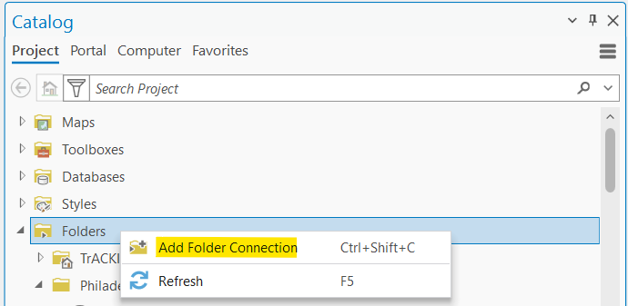
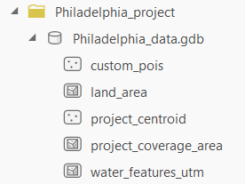

# Step 1: Create Base Dataset

These steps download all of the necessary network and point of interest (POI) data from OpenStreetMap (OSM) to allow you to conduct subsequent access analyses across the region represented in this base dataset. This process is organized into four sub-steps outlined below.

## Step 1A: Download Base OSM Data

Make sure an ArcGIS map is open before running this tool. Enter parameters as described in the table below. This tool downloads OSM data to generate a set of “.osm” files for ways, POI, and water. It also creates a placeholder geodatabase where spatial files will subsequently be saved.

Note that occasionally the Overpass API, which is used to download OSM data, can time out or return an error if the servers are busy. If this happens, the tool will automatically attempt to re-initiate the failed download(s) behind the scenes for you until they succeed. You can “View Details” as the tool is running to monitor the download progress.

To avoid filepath length issues later on, you should keep your project folder and project names on the shorter side (below 140 characters combined). You may also want to consider moving your TrACKIT files to a higher-level folder. If your filepath is too long, TrACKIT will throw warning messages.

| Parameter Name | Description | Example |
| :--- | :--- | :--- |
| Place Project Folder Here | Path where you would like to initialize a project folder to store data produced by the TrACKIT toolkit. This top-level folder (for example, C:\TrACKIT) must already exist and does not need to be in the same location as the ArcGIS project. **It also should not be the same folder where the TrACKIT toolbox code repository is saved on your computer.** It is recommended to create a dedicated top-level folder for all TrACKIT files in a location on your computer that has enough room to store up to ~25GB. This is the folder that this parameter should point to.| C:\TrACKIT |
| Project Name (No Spaces) | Name of project folder to be created. Folder will automatically be appended with “_project” and stored underneath the top-level folder identified above. | Test |
| Download Extent (Miles from Project Center) | Radius (miles) from the project center for data download. Subsets can be created later when creating specific project scenarios, but this overall coverage radius cannot be expanded later without re-running this step. A reasonable radius is one that covers all of the residential area within which you would like to run specific scenarios, as well as enough buffer to account for the distance that can be traveled within the largest travel time threshold you would like to analyze. This is generally up to around 30 miles. | 30 |
| Download Center Latitude/Longitude | Approximate dataset center coordinates (lat/long). The selected extent buffers around this point to define the total data download area. The tool will populate these based on the current map view, or you may overwrite them if you have coordinates you would like to copy-paste into these fields. To find coordinates, you can also right-click on the map at your desired center point and choose “Copy Coordinates” and paste the result into these fields. | 42.3655/-71.0852 |

The tool produces several non-spatial outputs that are visible in the File Explorer, as well as several spatial outputs that can be viewed in ArcGIS Pro.

Expected non-spatial outputs (visible via File Explorer):

- ProjectName_project
- ProjectName_project\ProjectName_data.gdb
- ProjectName_project\ProjectName_poi.osm
- ProjectName_project\ProjectName_water.osm
- ProjectName_project\ProjectName_ways.osm
- ProjectName_project\settings_poi.yaml

Make sure to check that the “.osm” files have been generated and that their file sizes are reasonable. If they are very small (e.g., 1 KB), there may have been an issue with the API call that will require you to run the tool again.

Additional spatial outputs within the project geodatabase (visible from within ArcGIS):

- ProjectName_project\ProjectName_data.gdb\land_area
- ProjectName_project\ProjectName_data.gdb\project_centroid
- ProjectName_project\ProjectName_data.gdb\project_coverage_area
- ProjectName_project\ProjectName_data.gdb\water_features_utm

To view these spatial outputs and all subsequent spatial outputs generated by the toolbox, you will need to add a folder connection to the project folder generated by this step. In the Catalog pane, right-click the “Folders” item and select “Add Folder Connection”:

Then, navigate to the project folder you specified in “Place Project Folder Here” to create a link to this folder in ArcGIS Pro. You can then expand the project folder to confirm that all of the expected spatial outputs have been successfully generated. You can also drag and drop any of these feature classes onto the map to preview them in ArcGIS Pro:

## Step 1B: Prepare Network Data from OSM

This tool uses “.osm” files generated in [Step 1A](step1/#step-1a-download-base-osm-data) to produce a series of “.data” files, which it then uses to generate travel network feature classes in the geodatabase. Once this tool is run, you will find two network-related feature classes (“project_network_ways”, “project_network_nodes”) in your geodatabase. These will cover the entire area defined in [Step 1A](step1/#step-1a-download-base-osm-data). These base datasets are the building blocks used in the rest of the tool.

This tool can take a long time to run, depending on the size of data downloaded from OSM. (See [FAQs and Troubleshooting](faqs.md) for additional information on expected runtimes for each step in the toolbox.)

| Parameter Name | Description | Example |
| :--- | :--- | :--- |
| Existing Project | Name of the project that you created in [Step 1A](step1/#step-1a-download-base-osm-data). TrACKIT automatically keeps track of all previous projects you have generated using the toolkit and automatically adds them to the drop-down menus in the toolkit’s tools. Simply select the relevant project name from the drop-down menu. | Test |

Expected non-spatial outputs (visible from File Explorer):

- ProjectName_project\ProjectName_nodes.data
- ProjectName_project\ProjectName_nodes_count.data
- ProjectName_project\ProjectName_ways.data

Additional spatial outputs in the geodatabase (visible from within ArcGIS):

- ProjectName_project\ProjectName_data.gdb\project_network_nodes
- ProjectName_project\ProjectName_data.gdb\project_network_ways

Make sure to review the generated “project_network_nodes” and “project_network_ways” feature classes in ArcGIS before moving on to the next step. These feature classes contain the travel network data that will be used as a baseline for your access analysis, so it is important that these feature classes accurately reflect the on-the-ground reality of the travel network near any scenario(s) you wish to analyze. In particular, it can be helpful to check that the network ways near the planned project scenario location(s) are accurately tagged for the allowed modes.

One way to do so is to apply a Definition Query on the “project_network_ways” layer. In ArcGIS Pro, add the “project_network_ways” layer to the map and right-click on the layer in the Contents pane. Select “Properties” and switch to the “Definition Query” tab. Add a new definition query where the mode of interest (e.g., personal vehicle, freight truck, pedestrian, bicycle, low stress pedestrian, and low stress bicycle) is equal to 1. Apply the filter and examine the resulting network near the scenario location(s) you wish to analyze.

If there are critical links missing for that mode, edit the “project_network_ways” layer at this stage to reflect the current on-the-ground reality for that travel mode. If you need to make manual edits to correct or supplement the baseline data, see recommendations for how to make manual edits in [Step 2B: Make Manual Edits to the Scenario Network](step2.md#step-2b-make-manual-edits-to-the-scenario-network). Alternatively, correct the underlying OSM data in OpenStreetMap to contribute it back to the OSM community and re-run from [Step 1A](step1/#step-1a-download-base-osm-data).

## Step 1C: Prepare POI Data from OSM

This tool uses “.osm” files generated in [Step 1A](step1/#step-1a-download-base-osm-data) to produce a series of “.data” files, which it then uses to generate POI feature classes in the geodatabase. This tool also lets you create custom POI categories, which you can then assign data to in [Step 1D](step1/#step-1d-import-custom-poi-data-optional). Once this tool is run, you should find a POI feature class in your geodatabase. This will cover the entire area defined in 1A. These base data are the building blocks used in the rest of the tool. This step will also take several minutes to run. (See [FAQs and Troubleshooting](faqs.md) for additional information on expected runtimes for each step in the toolbox.)

| Parameter Name | Description | Example |
| :--- | :--- | :--- |
| Existing Project | Name of the project that you created in [Step 1A](step1/#step-1a-download-base-osm-data). | Test |
| Custom POI Categories to Add | Names for custom POI categories to add to the default POI categories list. These new categories will not contain any data until [Step 1D](step1/#step-1d-import-custom-poi-data-optional) is run. | New_POI |

Expected outputs:

- ProjectName_project\ProjectName_pois.data (visible via File Explorer)
- ProjectName_project\ProjectName_pois_nodes.data (visible via File Explorer)
- ProjectName_project\ProjectName_data.gdb\custom_pois (visible from within ArcGIS)
- ProjectName_project\ProjectName_data.gdb\project_pois_nodes (visible from within ArcGIS)

Make sure to check the “project_pois_nodes” file before moving on to the next step. Make sure any custom POI categories you added are included as field names. If there are critical POIs missing in the “project_pois_nodes” layer, these can be added in the optional [Step 1D](step1/#step-1d-import-custom-poi-data-optional). You can also add data to your custom POI categories in [Step 1D](step1/#step-1d-import-custom-poi-data-optional).

## Step 1D: Import Custom POI Data (Optional)

This is an **optional** step that allows you to supplement the OSM-generated POI data with any missing destinations. You may notice that OSM data can mislabel or omit health service facilities, educational facilities, or other facilities that could be important to account for in generating a complete access picture for the POI categories you wish to include in your analysis. You might also want to assess access to an entirely separate category of destinations. Step 1D uses the “custom_pois” feature class template generated in [Step 1C](step1/#step-1c-prepare-poi-data-from-osm) to add additional destination points to “project_pois_nodes” generated in [Step 1C](step1/#step-1c-prepare-poi-data-from-osm). Create new point features in the "custom_pois" feature class and edit the attributes to correspond to the POI categories. Save changes and close out of the "custom_pois" attribute table before running the tool.

| Parameter Name | Description | Example |
| :--- | :--- | :--- |
| Existing Project | Name of the project that you created in [Step 1A](step1/#step-1a-download-base-osm-data). | Test |
| Import Dataset | Path to your “custom_pois” feature class with supplemental POI data. This file must match the format in the “custom_pois” feature class template generated in [Step 1C](step1/#step-1c-prepare-poi-data-from-osm). POI category fields should be assigned a value of 1 if the destination corresponds to that category, or else either a 0 or Null value. New points can be assigned more than one POI category. | custom_pois |
| Replace existing custom POI data | If this checkbox is checked, all previous custom POI data added to your “project_pois_nodes” feature class will be replaced. This is turned on by default. If this checkbox is unchecked, custom POI data from your import dataset will be appended alongside any previous custom POI data that has already been added to your “project_pois_nodes” feature class. | N/A |

Expected outputs:

- Changes to ProjectName_project\ProjectName_data.gdb\project_pois_nodes (visible from within ArcGIS)

Make sure to check the “project_pois_nodes” file before moving on to the next step. After running the tool, if any custom POI nodes correspond to the same POI (e.g., multiple access points along the border of a park), edit the “poi_final_id” attribute in the “project_pois_nodes” feature class to have the same ID value.

[Continue to Step 2](step2.md){: .md-button style="font-size: 1.5em; padding: 0.8rem 2rem; display: block; width: max-content; margin: 2rem auto; background-color: #eeeeee; border: 2px solid black; color: black;" }