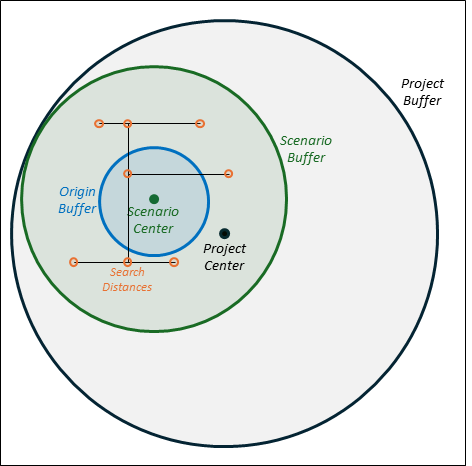

# Step 2: Create Project Scenarios and Edit Network

The next step when using TrACKIT is to develop a specific project scenario on which you will conduct an access analysis. A scenario consists of a subset of the original travel network dataset, centered around a specific area where you are interested in understanding the effect of a specific set of infrastructure changes. This could be a particular neighborhood or district proximate to a proposed infrastructure project.

The scenario creation tool will copy over a subset of the full travel network dataset downloaded in Step 1. When creating a scenario, you may adjust the travel network radius to something less than or equal to the original radius used to generate the project dataset. Choosing a smaller radius can be useful if your scenario focuses on a smaller region or more localized travel modes (such as bicycle or pedestrian) that are likely to result in a smaller travel radius than the full extent of the project. The smaller the scenario radius, the less computation time is required to generate each subsequent step in the toolbox. It is important, however, to make sure that your scenario’s radius is large enough to cover the largest distance a resident could reasonably travel outwards from the “origins” on the fastest travel mode within the largest travel time threshold you are interested in analyzing. See “A Note on Radii” below to better understand the relationship between the various radius concepts used in the toolkit. Note that origins are generated in [Step 2D](step2/#step-2d-identify-origins-and-create-connectors).

## A Note on Radii

Several radius parameter values are entered by the user in TrACKIT, as shown below.

| Step | Parameter | Typical Value | Description |
| :--- | :--- | :--- | :--- |
| [1A. Download Base OSM Data](step1/#step-1a-download-base-osm-data) | Download Extent (Miles from Project Center) | 30 miles | The radius for which OSM data are downloaded. All of the other radius values should be smaller than this value. |
| [2A. Create Project Scenario Dataset](step2/#step-2a-create-project-scenario-dataset) | Scenario Radius (Miles from Scenario Center) | 15 – 20 miles | Size of scenario data. This is a subset of the base project dataset from [1A](step1/#step-1a-download-base-osm-data). |
| [2D. Identify Origins and Create Connectors](step2/#step-2d-identify-origins-and-create-connectors) | Origin Radius (Miles from Origin Center) for Census Blocks | 0.5 – 1.5 miles | If Census Block origins are selected, this radius distance determines which Census Blocks are used as origins. These are the areas where we are trying to understand the extent of access change that residents may experience as a result of the scenario. |
| [2E. Match POIs to Network Nodes](step2/#step-2e-match-pois-to-network-nodes) | Search Distance | 300 feet | Buffer distance around each travel network node used to identify nearby POIs. Any POI that falls within this buffer is treated as accessible from that network node. In other words, the buffer represents the furthest off-network distance a POI may be from a network node to still be considered accessible. |

Once you’ve generated a scenario dataset from the original project dataset, you will then edit specific network links in this scenario data subset to represent the infrastructure changes you would like to test for your scenario. The scenario data subset will essentially keep track of two versions of the network—the “Original Network” as it exists prior to any infrastructure changes, and the “Scenario Network” reflecting the infrastructure changes you are interested in testing. Both versions of the network live together in a single scenario dataset but are distinguished using the “Exists in Original Network” and “Exists in Scenario Network” fields. More detail is provided below on how to accurately populate these fields for network links that are part of the infrastructure changes you are testing.

Then, you will use the toolkit to connect your origins and POIs to this edited network so that you are ready to run the access impact analysis. This process is organized into the 5 sub-steps outlined in the following sections.

## Step 2A: Create Project Scenario Dataset

This tool copies over a subset of the full data downloaded in Step 1 into a new scenario folder and geodatabase according to the parameters listed in the table below. This tool will also automatically add some additional detail to the network to ensure that it is ready for analysis, such as adding network links to ensure pedestrians can travel in both directions on one-way streets and accounting for contraflow bike lanes.[^1] Once finished, the tool will automatically create a new map in your ArcGIS project named after your scenario and displaying your scenario data.

| Parameter Name | Description | Example |
| :--- | :--- | :--- |
| Existing Project | Name of the project that you created in [Step 1A](step1/#step-1a-download-base-osm-data). This contains the base dataset from which your scenario will be subset. | Test |
| Prefix | Desired scenario name. This will be used moving forward for this scenario. A new scenario folder and scenario geodatabase will be created using this name. Note that each scenario you generate for a project must have a unique name. Use the ["Remove Scenario Name”](maintenance/#operation-4-remove-scenario-name) or [“Remove Scenario Name and Delete from Disk”](maintenance/#operation-5-remove-scenario-name-and-delete-from-disk) tools to remove existing scenarios. | Scenario1 |
| Scenario Center Latitude/Longitude | Typically, this scenario center will be the same as or similar to the point entered in [Step 1A](step1/#step-1a-download-base-osm-data). However, a user may wish to define several project scenarios, which may each subset the base project dataset differently. Different scenarios can be used to focus on different neighborhoods or regions within the larger project area. For example, a user might download data for the entire Boston region in [Step 1A](step1/#step-1a-download-base-osm-data) and then wish to subset this data for a scenario centered in Cambridge and another centered in East Boston. | 42.3638/-71.08526 |
| Scenario Radius (Miles from Scenario Center) | The radius used as a buffer from the scenario center when selecting which region of the full project dataset to copy as a subset into a new geodatabase to be used for the scenario. This radius must be less than or equal to the radius used when generating the project dataset. Select this value considering the maximum travel time for the fastest mode. For instance, to assess vehicle access within 30 minutes, a vehicle at 60 mph would cover approximately 30 miles from the scenario center in that period. | 20 miles |
| Scenario Modes | Select the modes you would like to focus on as part of this project scenario. The network will be filtered to just these selected modes. All six are selected by default. | Personal Vehicle, Freight Truck, Pedestrian, Bicycle, Low Stress Bicycle, Low Stress Pedestrian |
| Keep Selected POI Categories | Select the POI categories that you would like to focus on as part of this project scenario. Selecting fewer POI categories can reduce the size of your data which can improve performance, especially for very large analyses. | Parks and nature, Education childcare and preschool, Custom POI Category |

Expected outputs (visible from File Explorer):

- ProjectName_project\Scenario1
- ProjectName_project\Scenario1\Scenario1.gdb

Expected geodatabase outputs (visible from within ArcGIS):

- ProjectName_project\Scenario1\Scenario1.gdb\custom_origin_points_template
- ProjectName_project\Scenario1\Scenario1.gdb\custom_origin_polygons_template
- ProjectName_project\Scenario1\Scenario1.gdb\scenario_coverage_area
- ProjectName_project\Scenario1\Scenario1.gdb\scenario_network_nodes
- ProjectName_project\Scenario1\Scenario1.gdb\scenario_network_ways
- ProjectName_project\Scenario1\Scenario1.gdb\scenario_pois_nodes
- ProjectName_project\ProjectName_data.gdb\project_scenarios

Make sure to check the “scenario_network_ways” layer before moving on to the next step. The “project_scenarios” table logs all scenarios created for the project and logs their configurations (e.g., origin lat/long, modes, etc.).

## Step 2B: Make Manual Edits to the Scenario Network

This tool opens a new Map containing the layers you need to manually adjust the travel network links such that they reflect the infrastructure changes you would like to test in your scenario (i.e., new links, removed links, attribute changes to existing links, or geometry changes to existing links).

| Parameter Name | Description | Example |
| :--- | :--- | :--- |
| Existing Project | Name of the project that you created in [Step 1A](step1/#step-1a-download-base-osm-data). | Test |
| Scenario | Name of the scenario that you created in [Step 2A](step2/#step-2a-create-project-scenario-dataset). | Scenario1 |

When the tool is finished, it will open a new map with your “Scenario Network Ways” and “Scenario Network Nodes” layers. The tool will automatically symbolize the network with color-coded links based on the “Scenario Action” field to help you visualize any changes you make. “NEW” links appear in blue, “UPDATED” links in purple, and “REMOVED” links in red, while unchanged links remain gray.

[Action Required: Make Network Edits!Before moving on to Step 2C, make sure to make edits to your network.](network_edits.md){: .md-button style="padding: 1rem 1.5rem; display: block; width: 80%; max-width: 600px; margin: 2rem auto; background-color: #eeeeee; border: 1px solid black; color: black; white-space: normal; height: auto; text-align: center; line-height: 1.4;" }

## Step 2C: Integrate Manual Edits into Scenario Network

Once manual edits have been made to the network to reflect the project scenario, these changes need to be passed back into the tool for final cleaning. This integration process will assign new feature IDs to new links, split lines at shared vertices, and perform final checks to ensure connectivity and consistency. Prior to running this tool, make sure you have carefully followed the instructions for [Step 2B](step2/#step-2b-make-manual-edits-to-the-scenario-network), especially the rules related to shared vertices and required attributes.

This tool also allows the user to further split any links that are longer than a specified distance. This will increase the coverage of the “Match POIs to Network Nodes” tool ([Step 2E](step2/#step-2e-match-pois-to-network-nodes)), since the tool searches for POIs within a specified buffer distance of each network node, and will *not* match POIs that fall along the middle of link unless a network node split is present nearby.

| Parameter Name | Description | Example |
| :--- | :--- | :--- |
| Existing Project | Name of the project that you created in [Step 1A](step1/#step-1a-download-base-osm-data). | Test |
| Scenario | Name of the scenario that you created in [Step 2A](step2/#step-2a-create-project-scenario-dataset). | Scenario1 |
| Select Edited Scenario Network | Identify the name of the feature class associated with your edited scenario network. Make sure to clear any feature selections you have made in your chosen layer (Map > Selection > Clear) prior to running this step.| edited_network |
| Set maximum line length? | If this box is checked, line features that are longer than a specified distance will be split into two or more features, connected by nodes. This is recommended if increased coverage of the “Match POIs to Nodes” [Step 2E](step2/#step-2e-match-pois-to-network-nodes) tool is desired (since that tool searches for POIs within a specified buffer distance of each node). However, splitting can take a significant amount of time, especially for larger networks.| N/A |
| Maximum Segment Length (Feet) | If “Set maximum line length?” is selected, segments longer than maximum segment length will be split. This length should be roughly double the POI search distance length chosen later on to ensure maximum coverage.| 500 feet |

When the script ends, it will open a new map summarizing changes made to the network based on the manual edits. You can review this map to ensure that your intended edits have successfully been incorporated into the final network. The table below summarizes the different checks that result from running [Step 2C](step2/#step-2c-integrate-manual-edits-into-scenario-network).

| Check Layers | Symbol | Description |
| :--- | :--- | :--- |
| **Mode Mismatch** | ✖ (red X) | Network junctions where at least one connected link shares none of the modes associated with this junction. Check mode attribute assignments on all links at this junction. |
| **Added New Junctions** | ▲ (black triangle) | Network junctions that have been newly added as a result of shared vertices in the manually edited network. |
| **Searched During Integration** | ■ (orange square) | Network junctions on the original network that were included in the search space when integrating new links. |
| **New Vertex Matches Existing** | ●(blue circle) | Network junctions reviewed in the integration script that existed in the original network and that have been incorporated as endpoints for newly added links. |
| **Split Vertices for Max Length** | ✚(cross with pink outline) | Network junctions generated during the process that splits segments longer than the designated maximum length. |
| **Split Vertices from Integration** | ✚ (green cross) | Network junctions introduced at shared vertices between an existing link and a new link during the integration process. |

Also make sure that “Segment ID”, “From ID”, and “To ID” values have been added to your “New and Existing Ways” (in the geodatabase: “integrated_network_for_analysis”) feature class. A summary of integration changes is available in the integration text file in the scenario folder.

Expected geodatabase outputs (visible from within ArcGIS):

- ProjectName_project\Scenario1\Scenario1.gdb\integrate_vertex_report
- ProjectName_project\Scenario1\Scenario1.gdb\integrated_network_for_analysis
- ProjectName_project\Scenario1\Scenario1.gdb\integrated_nodes_for_analysis
- ProjectName_project\Scenario1\Scenario1.gdb\scenario_project_changes

Make sure to check the “integrated_network_for_analysis” and “integrated_nodes_for_analysis” layers before moving on to the next step.

## Step 2D: Identify Origins and Create Connectors

This step is where you define the study area—the “origins”—for which you want to analyze the change in access resulting from your infrastructure change. Origins should represent small regions (usually the size of a city block) whose overall access to opportunities could potentially be affected by a given infrastructure improvement. Two important criteria are helpful to keep in mind when selecting origins:

1. **Proximity to project location:** Origins should be proximate enough to the infrastructure change that they are likely to experience some overall change in access to opportunities as a direct result of the project. Origins that are far away from the project area and are not likely to experience a direct or meaningful change in access can be excluded from the analysis.
2. **Heterogeneity of access into the transportation network:** Origins should represent a contiguous area within which residents experience roughly similar access opportunities into the transportation network. (For example, an origin region should not span two distinct areas divided by a large interstate, since residents of such a region would not be likely to experience similar access opportunities into the transportation network.)

You have three methods for adding origins to the scenario:

- **Census Blocks:** Census Blocks are a good default option. By design, they meet both of the criteria discussed above. They are small geographic units that are generally “bounded by visible features such as roads, streams, and railroad tracks,”[^2] which lets us reasonably assume that access to destinations would not vary substantially within the same Census Block, particularly in urban areas. Users may want to exercise caution when using Census Blocks in suburban or rural regions, as “Census blocks in suburban and rural areas may be large, irregular, and bounded by a variety of features, such as roads, streams, and transmission lines.”[^3]
- **Custom Points:** These are useful if you want to depict specific residential complexes (ex: large apartment buildings, nursing homes, etc.) or features like transit stops.
- **Custom Polygons:** This is useful if your municipality or region has pre-defined districts or neighborhoods that meet the two criteria discussed above.

Each origin should have at least one corresponding demographic field with numeric values used for weighting when calculating accessibility metrics. By default, the Census Blocks option automatically downloads Census population and housing unit counts, and any Census Blocks with a population of zero are automatically removed from the analysis. If you are using custom points or polygons, you can map your demographic data into the “population” or “housing_unit_count” fields provided in the custom origin templates. You can also add your own custom demographic field. Any population or housing unit values left null or blank will automatically be populated with a default value of “1” so those origins are not entirely excluded from the analysis.

[Step 2D](step2/#step-2d-identify-origins-and-create-connectors) also generates centroid points for each origin polygon and produces connector links from each origin centroid to network nodes in the integrated travel network. (Note: If custom point origins are used, the origin points themselves will be used “as-is,” with connectors generated to link them to the integrated travel network.) These centroid connectors have the following properties:

- **One Way:** All centroid connectors are directed outward from the centroid as one-way links. This ensures trips can start at the centroid and enter the network, while preventing trips from taking shortcuts by routing back into the centroid.
- **Inherit Attributes:** The allowed transportation modes on each centroid connector are matched to those permitted on the “to” network node to which the connector links. Each connector also inherits the pre/postnetwork designation of its associated “to” network node, maintaining logical continuity in the network structure.
- **No Motorways:** Nodes representing motorways (i.e., limited access freeways) and motorway_links (i.e., ramps leading to limited access freeways) are excluded from the set of potential connection points. This prevents network access from starting directly on a motorway, as freeways generally do not allow direct ingress.
- **No Water or Highway Crossings:** Connectors that cross bodies of water or highways (motorways, trunks, or their associated links) are removed.

Two connector methodologies are available:

1. **Within a Distance** (recommended for polygons): Creates a connector from each origin centroid to every network node within a selected buffer distance of the associated origin geometry (e.g., the Census Block polygon boundary). Because this method assumes the origin represents an area where the node is already effectively "reached," the travel distance and travel time for these specific connectors are hardcoded to zero in the analysis. This method can be more complete but produces more connectors, which can affect processing speeds.
2. **Nearest Neighbor** (recommended for points): Uses a Delauney triangulation method to assign connectors to the nearest neighbor nodes for each mode and pre/post network. The tool calculates the straight-line distance of these connectors and assigns a standard walking travel time penalty to reach the network. This tends to produce fewer connectors but may oversimplify and reduce completeness.

| Parameter Name | Description | Example |
| :--- | :--- | :--- |
| Existing Project | Name of the project that you created in [Step 1A](step1/#step-1a-download-base-osm-data). | Test |
| Scenario | Name of the scenario that you created in [Step 2A](step2/#step-2a-create-project-scenario-dataset). | Scenario1 |
| Origin Selection Method | Choose between Census Blocks, Custom Points, or Custom Polygons. | Custom Points |
| Origin Custom Feature Class | If Custom Points or Custom Polygons is selected, provide the path to the layer with these features. This file must match the format in the “custom_origin_points_template” or “custom_origin_polygons_template” feature classes generated in [Step 2A](step2/#step-2a-create-project-scenario-dataset). If the population field is left as Null, the tool will assign a value of 1.| custom_origin_points_template |
| Origin Radius (Miles from Origin Center) for Census Blocks | If Census Blocks is selected, define a buffer radius around the origin center. The tool will pull all Census Blocks within this area to serve as origins. *Ensure this radius is smaller than both the Scenario and Project radii.* As discussed earlier, the selected radius should be chosen to ensure that the origins are proximate enough to the infrastructure change that they are likely to experience some overall change in access to opportunities as a direct result of the project. A reasonable starting range is between 0.5 and 1 mile. Also, note that computational demands increase with more origins.| 1 mile |
| Origin Center Latitude/Longitude | If Census Blocks is selected, this defines the latitude and longitude center point for the origin radius. It defaults to the Scenario center lat/long but can be manually edited to target a specific area. The tool will throw a warning if your selected Origin Center combined with your Origin Radius extends beyond the boundaries of your original Scenario coverage area.
 | 42.3638/-71.08526 |
| Method | Select which of the two centroid connector methods to use: Within a Distance (recommended for polygons) or Nearest Neighbor (recommended for points). | Within a Distance |
| Within a Distance (ft) | If Within a Distance is selected, specify the distance to buffer Census Block geometries. The tool will then identify intersecting nodes to use when generating centroid connectors. For Census Blocks and Custom Polygons, the recommended default is 100 feet. For Custom Points, the tool defaults to 1,000 feet to account for custom points that may be located further from the transportation network. | 100 feet |

Expected geodatabase outputs (visible from within ArcGIS):

- ProjectName_project\Scenario1\Scenario1.gdb\census_block_polygons *(Only if using Census Blocks)*
- ProjectName_project\Scenario1\Scenario1.gdb\census_block_polygons_projected *(Only if using Census Blocks)*
- ProjectName_project\Scenario1\Scenario1.gdb\connectors_graph
- ProjectName_project\Scenario1\Scenario1.gdb\origin_nodes

Make sure to check the “connectors_graph” layer before moving on to the next step.

Note that the “census_block_polygons_projected” layer excludes Census Blocks with a population of zero.

### How do I add data to the custom origins template?

1. Add your origins dataset as a layer in your map in ArcGIS Pro the way you would any other data layer.
2. Open ArcGIS Pro’s “Append” tool.
3. Select your own origins dataset as the “Input Dataset”.
4. For the “Target Dataset”, select the appropriate custom origin template—custom_origin_polygons_template or custom_origin_points_template—based on whether your dataset contains polygons or points.
5. Under “Field Matching Type”, select “Use the field map to reconcile field differences”. Then, click on each template field (origin_id, origin_name, population, housing_unit_count) and select a corresponding field in your own dataset that corresponds to values you would like to populate into each template field.
6. Click “Run” and then check that you can see your records transferred into the template feature class.

## Step 2E: Match POIs to Network Nodes

Now that the scenario network is complete, it is time to connect points of interest (POIs) to the travel network so it is ready for access analysis. This tool associates POIs within a designated distance of each network node to that network node, so that the network node can serve as a routing destination for reaching that POI. Note that nodes associated with motorways (i.e., limited access freeways) are excluded from the POI matching process, as freeways generally do not allow direct access to POIs. See the [FAQs and Troubleshooting](faqs.md) section for more detail on the methodology of how POIs are matched to network nodes.

| Parameter Name | Description | Example |
| :--- | :--- | :--- |
| Existing Project | Name of the project that you created in [Step 1A](step1/#step-1a-download-base-osm-data). | Test |
| Scenario | Name of the scenario that you created in [Step 2A](step2/#step-2a-create-project-scenario-dataset). | Scenario1 |
| Maximum Search Distance from Network Node to POI (Feet) | Maximum distance to search between the network node and the POI. This represents the maximum off-network distance a resident would be expected to travel for a POI to still be considered reachable. Too low a value may result in unreachable POIs. | 300 |

Expected geodatabase outputs (visible from within ArcGIS):

- ProjectName_project\Scenario1\Scenario1.gdb\node_poi_summary
- ProjectName_project\Scenario1\Scenario1.gdb\nodeid_poi_match

Make sure to check the “nodeid_poi_match” table before moving on to the next step.

[^1]: Two-way travel for pedestrians (and bicycles at a walking speed) are permitted on one-way streets by duplicating each one-way network link and reversing the direction of the feature. Contraflow bike lanes are incorporated using a similar method.
[^2]: https://www.census.gov/newsroom/blogs/random-samplings/2011/07/what-are-census-blocks.html
[^3]: Ibid.

[Continue to Step 3](step3.md){: .md-button style="font-size: 1.5em; padding: 0.8rem 2rem; display: block; width: max-content; margin: 2rem auto; background-color: #eeeeee; border: 2px solid black; color: black;" }